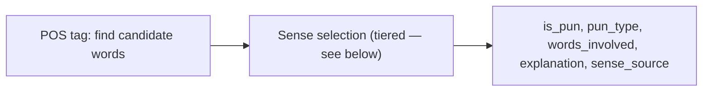
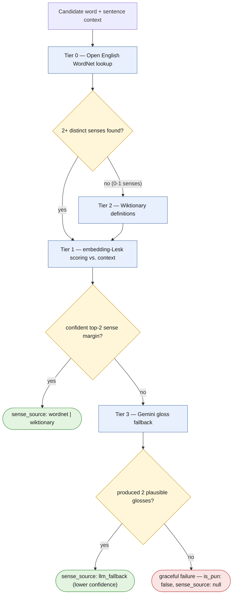

# Sense Selection Design

Full technical design for the Inference — Sense Selection workstream (see [`../project-spec.md`](../project-spec.md) for domain ownership and [`../milestones/milestone-3.md`](../milestones/milestone-3.md) Question 2 for the condensed course-facing answer this doc backs up).

## Where this fits

Sense selection is the step inside `/analyze` that decides *which word* in a sentence is doing double duty and *which two senses* it's balancing between. It sits after pun detection and feeds the `explanation`, `words_involved`, and (proposed) `sense_source` fields of the response — see [`../contracts.md`](../contracts.md).

## Approach

Handles **homographic** puns (one written word, two senses). Homophonic puns (sound-alike words) need a separate phonetic candidate-generation step — tracked as an open question below, not covered by this design.

1. **Candidate words — POS tagging.** Tag the sentence and keep only open-class tokens (NOUN, VERB, ADJ) as pun-word candidates. Closed-class function words essentially never carry the second sense, so this cuts the search space early and cheaply.
2. **Candidate senses — WordNet.** For each candidate word, pull its synsets and their glosses/hypernym chains — reuses the hypernym-chain code from Homework 2 directly.
3. **Local context — dependency parse.** Parse the sentence to find the grammatical relation the candidate sits in relative to its governing predicate — e.g., is *dough* the `obj` of *need* in "the baker needed more dough," or is *batter* the `nsubj` of *was ready* in "the batter was ready"? This is a tighter context than bag-of-words: "does this sense satisfy *this* slot of *this* predicate," not "does this sense appear near these other words."
4. **Score each sense against that slot — selectional preference.** Predicates express soft preferences about what fills their argument slots (Resnik's selectional association is the fully-general version). We approximate it — no parsed corpus to train a real association model from — by scoring hypernym-chain overlap against a small seed list of classes that typically fill that predicate+relation slot, falling back to gloss scoring (see Tier 1 below) when there's no seed for that predicate.
5. **Pun signal = tension, not a single winner.** Normal WSD picks the argmax sense. We want the *margin* between the top two candidate senses instead: two senses that are both plausible (small margin) and clearly distinct (different top-level hypernym — e.g. *dough* has one sense under `food` ("a paste of flour, water, etc." for baking) and one under `possession` (informal for money)) is the pun signal. That margin doubles as an input to `confidence`.
6. **Explanation.** Template the `explanation` string off the two winning glosses: `"{word}" can mean {gloss_1} or {gloss_2}; the sentence supports both because {evidence}`. For "the baker needed more dough": `"dough" can mean bread dough or (informally) money; the sentence supports both because a struggling bakery needs both`.

## Risk: WordNet coverage gaps

WordNet is a static, hand-curated resource, so it fails in predictable ways for pun text: slang, proper nouns, novel/compound usage, and glosses short enough to make literal word-overlap scoring noisy. Rather than one fallback, this is a tiered pipeline where each tier only runs when the previous one couldn't produce a confident answer, so degradation is graceful and measurable instead of all-or-nothing.

Each tier only fires when the one before it couldn't clear its decision gate — that's what makes this "graceful": every path terminates in a well-formed `/analyze` response, down to an explicit failure state, never an unhandled error.

**Tier 0 — cheap resource upgrade, same API shape.** Use the [Open English WordNet](https://github.com/globalwordnet/english-wordnet) (CC BY 4.0, actively maintained) instead of NLTK's bundled Princeton WordNet. Same synset/hypernym structure, no code-shape change, closes some coverage gaps for free before any fallback logic runs.

**Tier 1 — make the *scoring* robust, not just the lookup.** Literal gloss/context word overlap (simplified Lesk) is brittle because WordNet glosses are short and often circular. Score with **embedding-based Lesk** instead: embed the sentence context and each candidate gloss with a small `sentence-transformers` model (e.g. `all-MiniLM-L6-v2` — ~80MB, Apache-2.0, fits the Cloud Run cold-start budget in [`../../AGENTS.md`](../../AGENTS.md)), score by cosine similarity instead of exact word overlap. Same sense inventory, much less brittle scoring, still explainable (gloss + score shown in the response).

**Tier 2 — expand the sense inventory when WordNet has 0–1 senses for the candidate lemma.** No second sense means no pun story to tell. Before giving up, pull definitions from **Wiktionary** (CC BY-SA; the [kaikki.org](https://kaikki.org) pre-parsed Wiktionary JSON dumps avoid needing to run the extraction pipeline ourselves) for that lemma — much better coverage of slang and newer senses than WordNet. Score the same way as Tier 1.

**Tier 3 — the actual graceful failure.** If Tiers 0–2 still don't produce two distinct, confident candidate senses: prompt Gemini directly (already in the stack via Genkit, no new infra, stays inside the existing free quota) for two plausible glosses of the candidate word in context. This is the least interpretable tier and should be visibly a last resort. Even if this fails, `/analyze` must still return a well-formed response (`is_pun: false` or a low-`confidence`, non-null explanation) — never a 500.

**Alternatives considered and rejected:** BabelNet has much broader coverage but its free tier is non-commercial-only with real rate limits, which is a bad fit for a live demo (see the cold-start caveat in [`../project-spec.md`](../project-spec.md)).

### Contract impact

Adding a `sense_source: "wordnet" | "wiktionary" | "llm_fallback" | null` field to `/analyze` (done — see [`../contracts.md`](../contracts.md)) lets Eval measure how often each tier actually fires. This is a contract change per [`../../AGENTS.md`](../../AGENTS.md)'s rule — flagging here for Backend/Eval sign-off since both sides of `/analyze` depend on it.

## Open questions

- No phonetic pipeline yet for homophonic puns — steps 1–4 above only find double senses of *one* word, not sound-alike word pairs.
- The selectional-preference seed lists in step 4 are hand-built, not learned — unclear how much coverage they get before falling back to Tier 1 gloss scoring.
- Which of Prateek/Livia owns detection vs. sense selection — to be decided at PR time (see [`../milestones/milestone-3.md`](../milestones/milestone-3.md)).
- Wiktionary dump size/licensing footprint inside the Cloud Run image is unverified — may need to prune to single-word entries before bundling.
- The margin threshold from Tier 1 (when two senses count as "close enough" to be a pun) is unset until Eval runs this against real data (see below).

## Eval hooks

- Track `sense_source` distribution across the test set — "X% of puns needed fallback beyond WordNet" is a genuinely useful error-analysis metric for the write-up.
- SemEval-2017 Task 7 is curated/formal text and likely under-stresses Tiers 2–3. Also run the Pun of the Day corpus (more colloquial) specifically to exercise the Wiktionary and LLM-fallback tiers.
