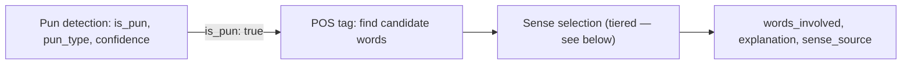
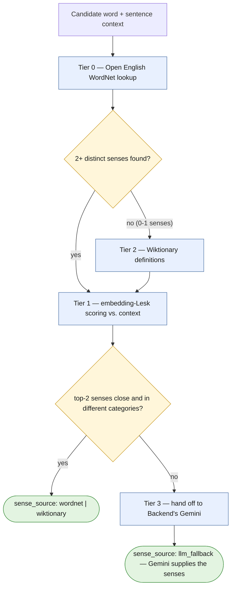

# Sense Selection Design

Full technical design for the Inference — Sense Selection workstream (see [`../project-spec.md`](../project-spec.md) for domain ownership and [`../milestones/milestone-3.md`](../milestones/milestone-3.md) Question 2 for the condensed course-facing answer this doc backs up; Tier 3 was redesigned on 2026-09-23, so this doc diverges from milestone-3's description of it).

## Where this fits

Sense selection is the step inside `/analyze` that decides *which word* in a sentence is doing double duty and *which two senses* it's balancing between. It runs only after pun detection has set `is_pun: true` (detection alone owns `is_pun`, `pun_type` and `confidence`), and feeds the `explanation`, `words_involved`, and `sense_source` fields of the response — see [`../contracts.md`](../contracts.md).

```mermaid
flowchart LR
    DET["Pun detection: is_pun, pun_type, confidence"] -- "is_pun: true" --> POS["POS tag: find candidate words"]
    POS --> SEL["Sense selection (tiered — see below)"]
    SEL --> OUT["words_involved, explanation, sense_source"]
```

## Approach

Handles **homographic** puns (one written word, two senses): recovering the two *contextual readings* that make a pun work. Homophonic puns (sound-alike words) aren't covered by this pipeline — detection has its own CMUdict-based phonetic candidate feature ([`detection.md`](detection.md)), but nothing here resolves the two readings for a sound-alike pun; those always hand off as `sense_source: llm_fallback`.

1. **Candidate words — POS tagging.** Tag the sentence and keep only open-class tokens (NOUN, VERB, ADJ) as pun-word candidates. Closed-class function words essentially never carry the second sense, so this cuts the search space early and cheaply.
2. **Candidate senses — WordNet.** For each candidate word, pull its synsets and their glosses/hypernym chains — reuses the hypernym-chain code from Homework 2 directly.
3. **Local context — dependency parse.** Parse the sentence to find the grammatical relation the candidate sits in relative to its governing predicate — e.g., is *dough* the `dobj` of *need* in "the baker needed more dough," or is *batter* the `nsubj` of *ready* in "the batter was ready"? The result is a `(relation, predicate)` pair of spaCy dependency labels (plus our `prep_<prep>` relations) and lemmas, cleaned up so step 4 always sees the real predicate rather than whatever word the candidate happens to attach to: a conjunct takes the slot of the first item in its list ("needed flour and dough" → `dobj` / *need*); a prepositional object skips the preposition and folds it into the relation ("hid the money in the dough" → `prep_in` / *hide*); and the subject of a copula-like verb with an adjective or noun complement takes that complement as its predicate ("was ready" → `nsubj` / *ready*, since *be* accepts any subject), while the complement in turn takes the subject ("was ready" → `acomp` / *batter*), so for complements `predicate` holds a noun and step 4 asks which sense fits the subject rather than the verb's slot; a sentence's root word has no predicate. This is a tighter context than bag-of-words: "does this sense satisfy *this* slot of *this* predicate," not "does this sense appear near these other words."
4. **Score each sense against that slot — selectional preference.** Predicates express soft preferences about what fills their argument slots (Resnik's selectional association is the fully-general version). We approximate it — no parsed corpus to train a real association model from — by scoring hypernym-chain overlap against a small seed list of classes that typically fill that predicate+relation slot, falling back to gloss scoring (see Tier 1 below) when there's no seed for that predicate.
5. **Sense-pair signal = tension, not a single winner.** Normal WSD picks the argmax sense. We want the *margin* between the top two candidate senses instead: two senses that are both plausible (small margin) and clearly distinct (different top-level hypernym — e.g. *dough* has one sense under `food` ("a paste of flour, water, etc." for baking) and one under `possession` (informal for money)) is what makes a sense pair a convincing pun reading. The margin doesn't decide `is_pun` (detection does) or feed `confidence` (the detector's probability): it decides whether sense selection has a confident pair to explain (`wordnet`/`wiktionary`) or hands off with `llm_fallback` (Tier 3).
6. **Explanation.** Template the `explanation` string off the two winning glosses: `"{word}" can mean {gloss_1} or {gloss_2}; the sentence supports both because {evidence}`. For "the baker needed more dough": `"dough" can mean bread dough or (informally) money; the sentence supports both because a struggling bakery needs both`.

### In code

Each step has its own module in `inference/`: `candidates.py` (step 1), `senses.py` (step 2 and Tiers 0 and 2), `context.py` (step 3) and `scoring.py` (steps 4 and 5, Tier 1). [`selection.py`](../../inference/selection.py) runs them over one parsed sentence. Pun detection calls its `select_senses()` once it has decided the text is a homographic pun, passing its own parse and its ranking of the candidate words. Calibration can call `pun_readings()` to measure what production runs: it yields every candidate with a pun reading, and with `threshold=math.inf` it shows every margin the other filters let through. It tries candidates in production's order only when it's given detection's ranking as `preferred`; otherwise sentence order decides which reading comes first. (Eval measures through `/analyze` instead.)

Candidates are tried in detection's ranking first, then in sentence order, and the first one with a pun reading wins, so the order decides *which* word gets explained when several qualify. Only the first 32 candidates in the sentence are tried, plus any detection ranked, to bound the work one long input can cost. A candidate's top two senses (step 5) count as a pun reading only when all of these hold:

- **The margin is at most `MARGIN_THRESHOLD`:** both senses fit about as well.
- **The runner-up's score is positive.** Two senses that both fit badly aren't a pun just because they fit equally badly.
- **The two senses share no other WordNet word.** Senses that do (say both list *bread*) are usually near-synonyms, even in different lexfiles. A sense WordNet can't pin to one synset (a Wiktionary sense, or a gloss two synsets share) can't veto a pair.
- **Their glosses aren't similar** (cosine below `GLOSS_DISTINCT_THRESHOLD`), even when their lexfiles differ: step 5's category check alone lets through near-identical glosses filed under different lexfiles.

Until TASK-21 lands, the explanation doesn't follow step 6's template yet. It reads `"{word}" can mean {gloss_1} or {gloss_2}.`, then the evidence (the seeded slot, or the glosses' similarity to the sentence), then the score difference, and says it's a proposed interpretation.

## Risk: WordNet coverage gaps

WordNet is a static, hand-curated resource, so it fails in predictable ways for pun text: slang, proper nouns, novel/compound usage, and glosses short enough to make literal word-overlap scoring noisy. Rather than one fallback, this is a tiered pipeline where each tier only runs when the previous one couldn't produce a confident answer, so degradation is graceful and measurable instead of all-or-nothing.

```mermaid
flowchart TD
    IN["Candidate word + sentence context"] --> T0["Tier 0 — Open English WordNet lookup"]
    T0 --> D0{"2+ distinct senses found?"}
    D0 -- "yes" --> T1["Tier 1 — embedding-Lesk scoring vs. context"]
    D0 -- "no (0-1 senses)" --> T2["Tier 2 — Wiktionary definitions"]
    T2 --> T1
    T1 --> D1{"top-2 senses close and in different categories?"}
    D1 -- "yes" --> OK1(["sense_source: wordnet | wiktionary"])
    D1 -- "no" --> T3["Tier 3 — hand off to Backend's Gemini"]
    T3 --> OK2(["sense_source: llm_fallback — Gemini supplies the senses"])

    classDef tier fill:#e8f0fe,stroke:#4a6fa5,color:#1a1a1a;
    classDef decision fill:#fff6da,stroke:#c9971f,color:#1a1a1a;
    classDef success fill:#e3f4e1,stroke:#3f8f3f,color:#1a1a1a;
    class T0,T1,T2,T3 tier;
    class D0,D1 decision;
    class OK1,OK2 success;
```

Each tier only fires when the one before it couldn't clear its decision gate — that's what makes this "graceful": every path terminates in a well-formed `/analyze` response, down to the explicit `llm_fallback` hand-off, never an unhandled error.

**Tier 0 — cheap resource upgrade, same API shape.** Use the [Open English WordNet](https://github.com/globalwordnet/english-wordnet) (CC BY 4.0, actively maintained) instead of NLTK's bundled Princeton WordNet. Same synset/hypernym structure, no code-shape change, closes some coverage gaps for free before any fallback logic runs.

**Tier 1 — make the *scoring* robust, not just the lookup.** Literal gloss/context word overlap (simplified Lesk) is brittle because WordNet glosses are short and often circular. Score with **embedding-based Lesk** instead: embed the sentence context and each candidate gloss with a small sentence-embedding model (`all-MiniLM-L6-v2`, ~87 MB, Apache-2.0), run through `fastembed`'s ONNX runtime rather than `sentence-transformers`, which would pull in torch. The model is baked into the Inference image at build time, and with it loaded the container peaked at ~352 MB of Cloud Run's 512 MiB default (measured in TASK-19). Score by cosine similarity instead of exact word overlap. Same sense inventory, much less brittle scoring, still explainable (gloss + score shown in the response). Two senses count as being in *different categories* when their WordNet lexfiles differ (e.g. `noun.food` vs `noun.possession` for *dough*); when either sense has no useful lexfile (Wiktionary senses, or adjectives, which share `adj.all`), their gloss-embedding distance decides instead.

**Tier 2 — expand the sense inventory when WordNet has 0–1 senses for the candidate lemma.** No second sense means no pun story to tell. Before giving up, pull definitions from **Wiktionary** (CC BY-SA; the [kaikki.org](https://kaikki.org) pre-parsed Wiktionary JSON dumps avoid needing to run the extraction pipeline ourselves) for that lemma — much better coverage of slang and newer senses than WordNet. Score the same way as Tier 1. A winning pair that includes a Wiktionary sense reports `sense_source: "wiktionary"` even when its other sense came from WordNet, since WordNet alone couldn't have produced that pair.

**Tier 3 — hand off to Backend's Gemini.** If Tiers 0–2 still don't produce two distinct, confident candidate senses, Inference doesn't call an LLM itself. It returns `is_pun: true` with `sense_source: "llm_fallback"`, an empty `explanation`, and whatever candidate word(s) it found in `words_involved`. Backend passes that result to Gemini unchanged as the `analyze_pun` tool output, and Backend's system instruction tells Gemini that `llm_fallback` means it has to supply two plausible glosses and the explanation itself, framed as a lower-confidence reading. Because detection alone decides `is_pun`, a detector false positive also lands here, so Gemini may conclude the text isn't a pun after all. Keeping every Gemini call in Backend means one service owns the Gemini key and its quota, and Inference stays a pure NLP service: no LLM dependency, no key of its own, nothing extra to mock in its tests. This is the least interpretable tier and should be visibly a last resort; `/analyze` itself still never returns a 500.

**Alternatives considered and rejected:** BabelNet has much broader coverage but its free tier is non-commercial-only with real rate limits, which is a bad fit for a live demo (see the cold-start caveat in [`../project-spec.md`](../project-spec.md)).

### Contract impact

Adding a `sense_source: "wordnet" | "wiktionary" | "llm_fallback" | null` field to `/analyze` (done — see [`../contracts.md`](../contracts.md)) lets Eval measure how often each tier actually fires. `llm_fallback` is a hand-off signal rather than a record of what ran: Inference sets it when no tier succeeded, and Backend's Gemini acts on it (decided 2026-09-23; Tier 3 originally had Inference prompt Gemini itself, which would have given Inference a Gemini dependency and a second service spending the same quota). This is a contract change per [`../../AGENTS.md`](../../AGENTS.md)'s rule — flagging here for Backend, Eval and Frontend sign-off: all three depend on `/analyze`'s shape (Frontend through the `analyze_pun` tool result it renders).

## Open questions

- No contextual-reading pipeline for homophonic puns — steps 1–4 above only find double senses of *one* spelling, not which sound-alike word pair (if any) a pun is playing on. Detection's phonetic feature ([`detection.md`](detection.md)) only answers "does a dictionary homophone exist," not which one is contextually relevant; resolving the actual pair is still `llm_fallback`.
- The selectional-preference seed lists in step 4 are hand-built, not learned — unclear how much coverage they get before falling back to Tier 1 gloss scoring.
- Domain ownership is settled (Andi leads Sense Selection, Livia leads Detection, Yai leads Conversational, Prateek leads Eval — see [`../milestones/milestone-3.md`](../milestones/milestone-3.md)), and ~~the exact hand-off point between Andi (starting at Tier 0) and Yai (starting at Tier 3) within Sense Selection is still open~~ — resolved 2026-09-23: Tier 3 moved to Backend (Yai's domain), and the hand-off is `sense_source: "llm_fallback"` in [`../contracts.md`](../contracts.md).
- ~~Wiktionary dump size/licensing footprint inside the Cloud Run image is unverified — may need to prune to single-word entries before bundling.~~ — resolved 2026-09-26 (TASK-17): the English dump is 3.3 GB; pruned to single-word English noun/verb/adj entries, one gloss per sense, dropping form-of/alt-of senses (e.g. "plural of dough"), it is a ~66 MB SQLite file (`inference/scripts/build_wiktionary_db.py`). It ships as a GitHub Release asset downloaded at Docker build time, with CC BY-SA attribution in [`../../inference/README.md`](../../inference/README.md).
- ~~The margin threshold from Tier 1 (when two senses count as "close enough" to be a pun) is unset until Eval runs this against real data (see below).~~ — resolved 2026-10-02 (TASK-2.4): `MARGIN_THRESHOLD` calibrated to **0.03** (down from the 0.1 placeholder) via `inference/scripts/calibrate_margin.py` against the SemEval eval dataset's homographic `is_pun:true` rows (sentence-level recall: the lowest-margin candidate per sentence) and `is_pun:false` rows (candidate-level false-positive proxy, since sense selection only runs once detection already says `is_pun:true`). 1,602 of 1,607 homographic-pun rows (99.7%) had at least one candidate with an embedding-Lesk signal; the recall figures below are over those eligible rows (counting the other 5 as misses would put 0.03's recall at ~71.2% instead of 71.4%). Margins for real puns and ordinary polysemous words overlap heavily at every threshold tried, so no value gives clean separation; 0.03 (71.4% recall, 25.8% false-positive rate) was chosen over higher values (e.g. 0.1's 97.5% recall but 63.0% false positives) because a miss degrades gracefully to Tier 3's `llm_fallback`, while a false positive confidently explains the wrong candidate word as the pun. Sense-count normalization (`margin * sense_count`, see below) was tested and rejected: it performed worse at matched recall than the flat threshold.
- ~~Embedding-Lesk margins shrink as a word gains senses... TASK-2.4's calibration should check whether the margin needs to account for the number of senses.~~ — resolved 2026-10-02 (TASK-2.4): tested and rejected. Correlation between margin and sense count was weak on both the negative set (candidate-level, r = -0.228) and the positive set (sentence-minimum, r = -0.080) — too weak to be the dominant driver of the overlap above. Normalizing by `margin * sense_count` gave a *worse* false-positive rate at matched recall than the flat threshold (e.g. 0.522 vs. 0.389 at ~85% recall), so `MARGIN_THRESHOLD` stays a flat constant, not a sense-count-adjusted formula.
- Binary selectional preference ignores the rest of the sentence, so a two-category slot (`need`/`want` + object → food or money) ties any word with both a food and a money sense: "I want more bread with my soup." has margin 0. Sense selection only runs once the detector says `is_pun: true`, so this matters when the detector is wrong. It then confirms the false positive with a confident explanation instead of catching it.

## Eval hooks

- Track `sense_source` distribution across the test set — "X% of puns needed fallback beyond WordNet" is a genuinely useful error-analysis metric for the write-up. Report it per `pun_type`: homophonic puns aren't covered by this pipeline (see Approach), so they always come back as `llm_fallback` and would swamp an overall rate. Inference should also log *why* it fell back (no confident pair vs. an internal error), so bugs don't read as coverage gaps.
- SemEval-2017 Task 7 is curated/formal text and likely under-stresses Tiers 2–3. Also run the Pun of the Day corpus (more colloquial) specifically to exercise the Wiktionary tier and the `llm_fallback` hand-off. Against `/analyze` alone the hand-off only shows up as `sense_source` (with `explanation: ""`); judging the explanations Gemini supplies needs the full pipeline through `/api/chat`, and each eval row should confirm an `analyze_pun` tool call actually happened, since Backend's system instruction asks Gemini to call it rather than forcing it.
