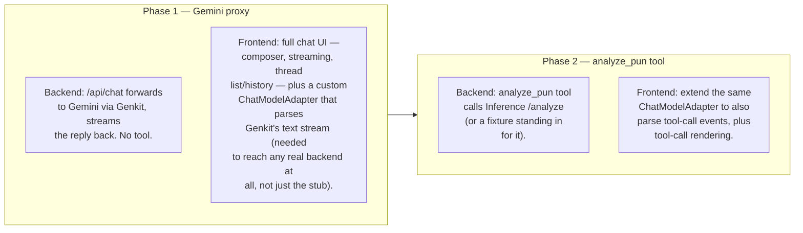

# Engineering Practices — Isolation, Dev Experience, Progressive Enhancement

Complements [`project-spec.md`](project-spec.md): where that doc says *what* each domain owns, this one says *how* Backend and Frontend get built so they can move in parallel without blocking on each other's real implementation, and *in what order* the Backend/Frontend pipeline gets built out. Inference already has this property by design (see `project-spec.md`'s domain breakdown); this doc gives Backend and Frontend the same guarantee in both directions. See [`design/frontend-design.md`](design/frontend-design.md) for the frontend-specific mechanics these rules imply.

---

## Domain isolation

### Frontend in isolation

Frontend already consumes only the `/api/chat` contract (see [`contracts.md`](contracts.md)), with no dependency on Inference. That isolation needs to hold for Backend too:

- The one place Frontend talks to Backend is assistant-ui's `ChatModelAdapter`. A `StubChatModelAdapter` implementing the same interface — returning canned streams instead of calling `/api/chat` — lets the rest of the UI (composer, thread list, persistence, rendering) be built and tested with no Backend running at all.
- Unit tests (Vitest + React Testing Library — `frontend/`'s `pnpm test`, already wired up: [`frontend/vite.config.ts`](../frontend/vite.config.ts)'s `test` block, [`frontend/src/setupTests.ts`](../frontend/src/setupTests.ts)) run against the stub, never a live `/api/chat` call — see [`design/frontend-design.md`](design/frontend-design.md)'s "Development & testing" section for what those tests cover.
- Local dev can point at either the stub or a real running Backend behind a flag; CI always uses the stub, so test runs never depend on Backend being up, Gemini quota, or network access.

### Backend in isolation

Backend has two external dependencies once Genkit is wired up: Gemini (via Genkit) and Inference's `/analyze` endpoint. Both need to be mockable so Backend's own tests don't require live Gemini quota or a running Inference Cloud Run service:

- The `analyze_pun` tool implementation should call Inference through an injectable client (a function parameter or small interface), so tests substitute a fixture response matching the `/analyze` schema in [`contracts.md`](contracts.md) instead of making a live HTTP call.
- Genkit test doubles for the model call itself — check Genkit's own evaluation/testing harness first for a substitutable fake model responder before hand-rolling one.
- This mirrors what Inference already has (per `project-spec.md`: no dependency on Backend or Frontend) — the goal is that any one domain's tests can run with the other two down.
- **Test runner: node's built-in `node:test`**, run on plain Node, which strips TypeScript's types itself (Node 24+), exactly as `pnpm dev` does — `backend/`'s `pnpm test` runs `node --test tests/**/*.test.ts`, already wired up: see [`backend/tests/app.test.ts`](../backend/tests/app.test.ts). Because Node runs the `.ts` files as-is, relative imports name the `.ts` file (`tsc` rewrites them to `.js` in `dist/`), and `backend/tsconfig.json`'s `erasableSyntaxOnly` rejects the TypeScript syntax Node can't strip (`enum`, `namespace`, constructor parameter properties). No new dependency, since a Hono app is just a standard `Request`/`Response` — `app.request()` plus `node:assert` is enough, no framework-specific test adapter needed. This is also why `src/app.ts` exports the `Hono` instance separately from `src/index.ts`'s `serve()` call: tests import the app without booting a real server.

---

## Dev experience

- Each domain keeps its own single-command dev loop (`pnpm dev` for `frontend/`/`backend/`, `uv run uvicorn ... --reload` for `inference/`) as already documented in [`local-setup.md`](local-setup.md) — no change to that.
- Frontend's stub-vs-real toggle (per [`design/frontend-design.md`](design/frontend-design.md)'s "Development & testing" section, e.g. `VITE_CHAT_ADAPTER=stub|live`) crosses origins the moment it's pointed at a real Backend — `frontend/` and `backend/` run on different localhost ports even in dev (see [`local-setup.md`](local-setup.md)). Backend needs CORS middleware (e.g. `hono/cors`) for that flag to work locally, and the same requirement carries into production (Firebase Hosting calling Cloud Run is cross-origin too).
- [`.github/workflows/lint.yml`](../.github/workflows/lint.yml) already runs Biome/ruff/Mermaid checks on every push/PR; [`.github/workflows/test.yml`](../.github/workflows/test.yml) does the same for the `test` scripts above, one job per domain (`frontend`, `backend`). Because of the isolation rules above, neither job needs live secrets (no Gemini key, no Inference URL) to pass — they're just `pnpm --filter <package> run test` against stubs/fixtures.
- The per-domain deploy workflows ([`deploy-frontend.yml`](../.github/workflows/deploy-frontend.yml), [`deploy-backend.yml`](../.github/workflows/deploy-backend.yml), [`deploy-inference.yml`](../.github/workflows/deploy-inference.yml)) are path-filtered, one per domain, per [`local-setup.md`](local-setup.md): the frontend (Firebase Hosting) and backend (Cloud Run) ones deploy for real, and the inference one is still a placeholder until TASK-14. The isolation properties above are what make it safe for those three workflows to deploy independently without one domain's deploy blocking on another's implementation state.
- Running Frontend and Backend together for manual cross-domain testing: `pnpm dev` from the repo root runs both dev servers concurrently (`pnpm --parallel --filter frontend --filter backend run dev`), with each line of output prefixed by package name. Each domain's own single-command loop (`cd frontend && pnpm dev`, etc.) still works unchanged for anyone working in just one domain.

---

## Progressive enhancement (Backend → Frontend)

Rather than build the full Genkit + tool-calling pipeline before anything runs end-to-end, ship it in two phases so there's a complete, demoable thing after each one:

### Phase 1 — Gemini proxy only

- **Backend:** wire up Gemini via Genkit's Google AI plugin; `/api/chat` forwards the conversation straight to Gemini and streams the conversational reply back. No `analyze_pun` tool yet — Gemini just chats.
- **Frontend:** builds the entire chat experience — composer, thread list, streaming render, `localStorage`-backed persistence — against this real (if pun-oblivious) backend, per [`design/frontend-design.md`](design/frontend-design.md). This includes the custom `ChatModelAdapter` itself (parsing Genkit's text-only stream into assistant-ui message parts) — since Genkit isn't one of assistant-ui's built-in adapters, that translation layer is needed to reach *any* real backend, not just the Phase 2 tool-calling one.
- This phase alone is a demoable chatbot, well before pun detection exists.

### Phase 2 — add the `analyze_pun` tool call

- **Backend:** implement the `analyze_pun` tool definition, wire it to Inference's `/analyze` (or a fixture standing in for it until that domain's endpoint is live, per the isolation rule above), and handle the `tool_use` → tool-result round trip from `project-spec.md`'s architecture diagram.
- **Frontend:** extend the Phase 1 `ChatModelAdapter` to also parse `tool-call` stream events, and add tool-call rendering, per [`design/frontend-design.md`](design/frontend-design.md)'s "Tool-call visibility" section. Requires agreeing the tool-call event shape within the `/api/chat` stream first — see `project-spec.md`'s "Sync points."
- Additive on top of Phase 1's plumbing, not a rebuild — a natural milestone boundary for the backlog breakdown.

---

## Open items

- No shared fixture format yet for the `/analyze` stand-in that Backend (Phase 2) and Eval both need before Inference is live — should probably be one fixture referenced from [`contracts.md`](contracts.md) so the two sides can't drift apart.
- Backend's test coverage today is a smoke test against the current `/health` and not-yet-implemented `/api/chat` stub — it'll need real cases (Genkit test doubles, injected Inference fixture) once Phase 1/2 land, per the "Backend in isolation" section above.
- Frontend's test coverage today is a smoke test against the default Vite starter page — it'll need real cases (greeting/chat transition, `ThreadHistoryAdapter`/`RemoteThreadListAdapter` logic, `ChatModelAdapter` stream parsing) once the real UI replaces the starter, per [`design/frontend-design.md`](design/frontend-design.md)'s "Development & testing" section.
