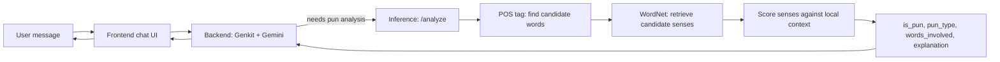

# Group 01 (Team PLAY): Milestone 3

## Question 1: All group member are communicating? If not, please list the group members

Yes. No issues

## Question 2: Did you determine how to implement sense selection for the joke/pun?  If yes, please briefly outline. If not, please indicate where you are stuck.

- The `/analyze` endpoint returns whether a message contains a pun, its type, the words involved, an explanation, and a confidence score.
- Sense selection is the core of that service: it decides *which word* is doing double duty and *which two senses* it's balancing.
- Scope: **homographic** puns only (one written word, two senses). Homophonic puns (sound-alike words) need a separate phonetic step — tracked as an open question.
- Because WordNet alone is static and predictably misses slang, proper nouns, and novel usage, the Inference pipeline as a whole gracefully degrades across a series of tiers — from WordNet-based detection (tier 0) up to an LLM fallback (tier 3) — so a low-confidence match never means an outright error.

### Domain assignment

| Domain | Scope | Lead |
|---|---|---|
| Conversational (Frontend + Backend/Orchestration) | React chat UI, Genkit `analyze_pun` tool, streaming, error handling | Yai Torres |
| Inference — Detection | pun / non-pun classifier, `pun_type` (homographic vs. homophonic) | Livia Esquejo Castro |
| Inference — Sense Selection | POS tagging, WordNet sense retrieval, context scoring, `explanation` text | Andi J. Castillo-Mauricio |
| Data / Eval | dataset curation, precision/recall on detection, calibrating the sense-selection threshold against SemEval | Prateek Grover (lead); all four contribute |

- Yai leads Frontend + Conversational, then supports Andi on Sense Selection at tier 3 (LLM fallback), while Andi starts at sense detection (tier 0).
- Livia leads Pun Detection; Prateek leads Data/Eval, shared by all four once Inference has something to evaluate.

### Approach, in brief

- POS-tag the sentence, keeping only open-class candidate words (NOUN/VERB/ADJ).
- Pull each candidate's WordNet synsets and glosses.
- Find the candidate's grammatical relation to its governing predicate (dependency parse).
- Score each sense against that slot via a selectional-preference approximation: hypernym-chain overlap against a small seeded class list, falling back to gloss overlap.
- Pun signal = the **margin** between the top two candidate senses under different top-level hypernyms (not a single argmax) — feeds `confidence`.
- `explanation` is templated off the two winning glosses.

## Question 3: Are your selected jokes involve information in specific domains (module 3)?

Our strategy is to fully nail one domain before expanding: food-based puns are the baseline, and only once that pipeline (detection, sense selection, explanation) works end-to-end do we treat a second domain as a stretch goal. Animal puns are the natural candidate for that stretch goal — our mascot is an otter, so covering both would be fitting 🦦!
