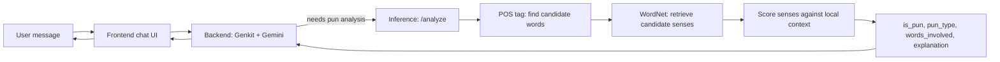

# Group 01 (Team PLAY): Milestone 3

## Question 1: All group member are communicating? If not, please list the group members

Yes. No issues

## Question 2: Did you determine how to implement sense selection for the joke/pun?  If yes, please briefly outline. If not, please indicate where you are stuck.

### Where this fits in the pipeline

The agent is a Gemini/Genkit chat backend that calls out to a dedicated Inference service (`analyze_pun`) whenever the model decides a message needs pun analysis; `/analyze` returns `{ is_pun, pun_type, words_involved, explanation, confidence }` (see [`../contracts.md`](../contracts.md)). Sense selection is the core of that Inference service — it's the step that decides *which word* in the sentence is doing double duty and *which two senses* it's balancing.

### Domain assignment

| Domain | Scope | Lead |
|---|---|---|
| Conversational (Frontend + Backend/Orchestration) | React chat UI, Genkit `analyze_pun` tool, streaming, error handling | Yai Torres |
| Inference — Detection | pun / non-pun classifier, `pun_type` (homographic vs. homophonic) | Livia Esquejo Castro |
| Inference — Sense Selection | POS tagging, WordNet sense retrieval, context scoring, `explanation` text | Andi J. Castillo-Mauricio (lead) |
| Data / Eval | dataset curation, precision/recall on detection, calibrating the sense-selection threshold below against SemEval | Prateek Grover (lead); all four contribute |

Yai leads Frontend + Conversational solo, with the explicit strategy of finishing it fast so Yai can then support Andi on Sense Selection — Andi starts at Tier 0 (the WordNet/embedding-scoring end), Yai agreed to pick up Tier 3 (the LLM fallback, see more below), and they meet in the middle once both are free. Livia leads Pun Detection and Prateek leads Data/Eval, though Eval is a shared responsibility all four contribute to once Inference has something to evaluate.

### The sense-selection approach

Sense selection only needs to handle **homographic** puns (one written word, two senses) — homophonic puns (sound-alike words) need a separate phonetic candidate-generation step; tracked as an open question below.

1. **Candidate words — POS tagging** ([Jurafsky & Martin, 2024, Ch. 17](../references.md)). Keep only open-class tokens (NOUN, VERB, ADJ) as pun-word candidates; closed-class function words essentially never carry the second sense.
2. **Candidate senses — WordNet.** Pull each candidate's synsets, glosses, and hypernym chains, reusing the hypernym-chain code from Homework 2.
3. **Local context — dependency parse** ([Jurafsky & Martin, 2024, Ch. 19](../references.md)). Find the grammatical relation the candidate sits in relative to its governing predicate — e.g., is *dough* the `obj` of *need* in "the baker needed more dough"? This asks "does this sense fit *this* slot," not "does this sense appear near these other words."
4. **Score each sense against that slot — selectional preference** ([Jurafsky & Martin, 2024, Ch. 21](../references.md)). Approximate Resnik's selectional association with hypernym-chain overlap against a small hand-seeded list of classes per predicate+relation (no parsed corpus to train a real model from), falling back to gloss overlap when there's no seed for that predicate.
5. **Pun signal = tension, not a single winner.** Score the *margin* between the top two candidate senses instead of picking an argmax: a small margin between two senses under clearly different top-level hypernyms — e.g. *dough* has a sense under `food` (bread dough) and a sense under `possession` (informal for money) — is the pun signal, and it feeds `confidence`.
6. **Explanation.** Template the `explanation` string off the two winning glosses.

### Managing WordNet's limits

The professor flagged that sense-level analysis may be limited by WordNet alone, and asked for either a more robust fallback or a graceful failure mode for when it can't deliver. WordNet is static and hand-curated, so it predictably misses slang, proper nouns, and novel usage, and its glosses are short enough to make literal overlap scoring noisy. We're handling that with a **tiered fallback** — each tier only fires when the one before it couldn't produce a confident answer, so degradation is graceful and measurable instead of all-or-nothing:

- **Tier 0:** swap in the actively-maintained Open English WordNet — same API shape, better coverage, still free.
- **Tier 1:** score candidate glosses against context with sentence embeddings instead of literal word overlap, fixing the noisy-short-gloss problem.
- **Tier 2:** if WordNet has 0–1 senses for the word, pull definitions from Wiktionary before giving up — much better slang/informal coverage.
- **Tier 3 (last resort):** prompt Gemini, already in the stack, for two plausible glosses; if even that fails, `/analyze` returns a well-formed, low-confidence response rather than erroring.

Full design — the tier-decision diagram, alternatives we ruled out (e.g. BabelNet, rejected for its non-commercial-only free tier), and remaining open questions (homophonic coverage, seed-list coverage, margin-threshold calibration) — lives in [`../design/sense-selection.md`](../design/sense-selection.md).

Full citations for the chapters referenced above are in [`../references.md`](../references.md).

## Question 3: Are your selected jokes involve information in specific domains (module 3)?

Our strategy is to fully nail one domain before expanding: food-based puns are the baseline, and only once that pipeline (detection, sense selection, explanation) works end-to-end do we treat a second domain as a stretch goal. Animal puns are the natural candidate for that stretch goal — our mascot is an otter, so covering both would be fitting 🦦!
