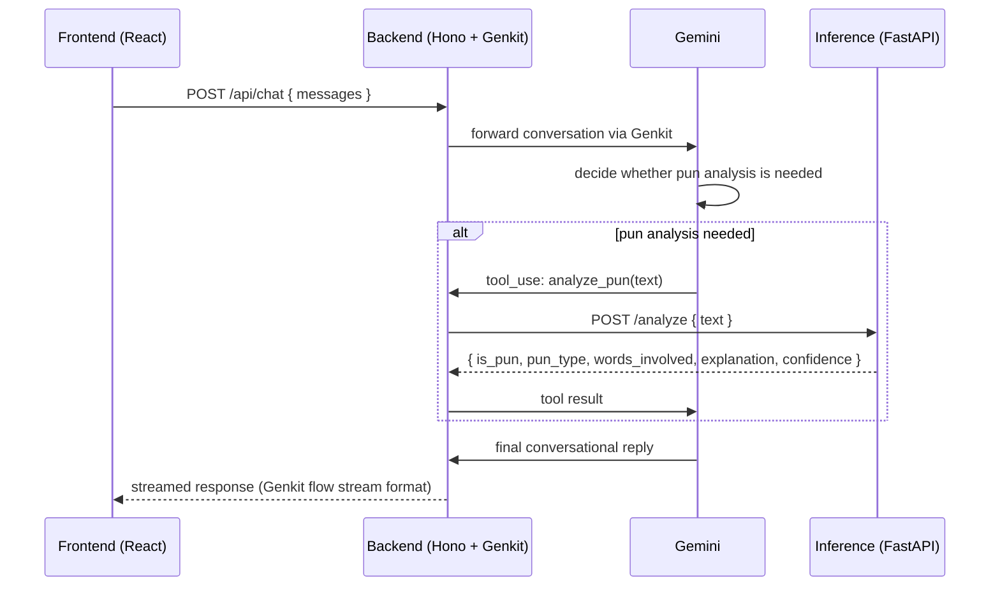

# Conversational Pun Analysis Agent — Project Spec

## Overview

We're building a conversational agent that detects and explains puns in text. The agent uses Gemini via Genkit (Google's AI SDK) as the conversational layer with tool-calling, a Cloud Run service hosting the pun classifier and word-sense disambiguation (WSD) logic, and a second Cloud Run service running the Genkit backend orchestration, with the React frontend on Firebase Hosting.

**Flow:** user sends a message → Genkit/Gemini decides whether pun analysis is needed → if so, it calls our `analyze_pun` tool → our backend forwards the request to the Inference Cloud Run service → the result comes back as a tool result → Gemini writes the final conversational reply.

---

## Stack

| Layer | Tool | Why |
|---|---|---|
| Conversational model | Gemini (Google AI Studio) | Genuinely free tier with real daily quotas — no credit card, doesn't run out mid-semester like trial credits do |
| Inference hosting | Google Cloud Run (Docker), Python + `uv` + FastAPI + ruff | Always Free tier (2M requests/mo); much faster cold start than Render's free tier; `uv` for fast, reproducible dependency management, `ruff` for lint/format |
| Backend orchestration | Google Cloud Run (Node) + [Hono](https://hono.dev/) + pnpm + Biome, Genkit added once the `analyze_pun` flow exists | Hono is a lightweight, TS-first web framework (chosen over Express for a more modern API and better exposure to current JS service patterns); Genkit is Google's equivalent of the Vercel AI SDK — unified model API, tool-calling, streaming flows — deploys to Cloud Run with one command |
| Frontend | Vite + React, pnpm + Biome, on Firebase Hosting | Free tier, CDN-backed, git-integrated static hosting for the React chat UI; Vite for fast local dev, Biome for one consistent lint/format tool across both Node packages |
| Data / Eval | Python + `uv` + [marimo](https://marimo.io/) notebooks | Reactive, git-diffable notebooks for dataset curation and evaluation write-ups |

**Notes on the choice:**
- Consolidating onto one Google Cloud project means one shared card/billing account for the whole team instead of separate Vercel, Render, and Hugging Face accounts — simpler credential-sharing, one place to check quota.
- **Card required, but no expected charges:** Cloud Run requires a Cloud Billing account attached to the project (a card on file), even to use the Always Free tier. Usage for a class project of this size should stay well within free-tier limits, so no actual charges are expected — the card is for Google's fraud verification, not billing.
- Genkit is provider-agnostic like the Vercel AI SDK: the tool-calling code written against Gemini can be pointed at Claude or another model later with a plugin swap.
- `frontend/` and `backend/` share one pnpm workspace at the repo root (one lockfile, one Biome config) since they're both Node/TypeScript packages; `inference/` and `eval/` are separate `uv` projects since their dependencies don't overlap.
- **Caveat:** Cloud Run scales to zero when idle, so the first request after a quiet period still has a cold start — meaningfully faster than Render's free tier, but not instant. Gemini's free tier can also throttle under heavy concurrent use. Rehearse a run before any live demo to make sure nothing's cold.

---

## Architecture

See [`contracts.md`](contracts.md) for the exact `/analyze` and `/api/chat` request/response schemas.

---

## Task breakdown by domain

Four domains, one lead each. Three of the four can start immediately against mocked contracts — only the two API contracts in [`contracts.md`](contracts.md) need to be agreed on day one.

### 1. Inference (ML/NLP)
**Owns:** the Inference Cloud Run service — pun classifier, WordNet-based WSD, explanation generation.

**Work:**
- Collect/prep dataset (SemEval-2017 Task 7 pun detection, Pun of the Day corpus)
- Fine-tune or wire up a pretrained classifier via Hugging Face Transformers
- Build WSD lookup (reuse WordNet hypernym work from Homework 2)
- Wrap it all in a FastAPI endpoint, containerized for Cloud Run

**Contract exposed:** `/analyze` — see [`contracts.md`](contracts.md).

**Design:** see [`design/sense-selection.md`](design/sense-selection.md) for the sense-selection approach and the tiered fallback for WordNet's coverage gaps.

This domain can work independently once the contract is agreed — no dependency on the backend or frontend services.

---

### 2. Backend / Orchestration
**Owns:** the Genkit backend on Cloud Run, the `analyze_pun` tool definition, conversation state/streaming.

**Work:**
- Wire up Gemini via Genkit's Google AI plugin
- Implement the `analyze_pun` tool to call the Inference domain's `/analyze` endpoint
- Handle streaming back to the frontend (Genkit's flow streaming)
- Handle errors/timeouts (e.g. Cloud Run cold start on the Inference service)

**Contract exposed:** `/api/chat` — see [`contracts.md`](contracts.md).

**Contract consumed:** Inference's `/analyze` schema — can build and test against a mocked response before Inference's real endpoint is live.

**Design:** see [`engineering-practices.md`](engineering-practices.md) for the build order (a plain Gemini proxy before the `analyze_pun` tool) and for keeping this domain testable without live Gemini quota or a running Inference service.

---

### 3. Frontend
**Owns:** React chat UI on Firebase Hosting.

**Work:**
- Chat interface, message history rendering
- Streaming display consuming the Genkit backend's stream
- Loading/error states, basic styling

**Contract consumed:** only `/api/chat`. Can build entirely against a stubbed backend response, no dependency on Inference.

**Design:** see [`design/frontend-design.md`](design/frontend-design.md) for the component library, visual design, and state management approach, and [`engineering-practices.md`](engineering-practices.md) for the isolation/testing/progressive-enhancement rules this and the Backend domain build against.

---

### 4. Data / Evaluation
**Owns:** dataset curation, test-set construction, end-to-end evaluation — also where the class deliverable (write-up, metrics, error analysis) lives.

**Work:**
- Build a held-out test set of puns/non-puns
- Run it directly against Inference's `/analyze` endpoint for precision/recall on detection
- Run a subset through the full pipeline to evaluate explanation quality

**Contract consumed:** same `/analyze` schema as Backend — can start as soon as Inference publishes the contract, in parallel with Backend/Frontend work.

---

## Sync points

The only hard dependencies across domains:
1. **Day one:** agree the `/analyze` request/response schema (Inference ↔ Backend, Data/Eval)
2. **Before Frontend wires up its streaming display:** agree the `/api/chat` streaming shape (Backend ↔ Frontend)
3. **Before Frontend builds tool-call rendering:** agree the shape of `tool-call` events within the `/api/chat` Genkit stream (Backend ↔ Frontend) — this is Phase 2 of the progressive-enhancement plan in [`engineering-practices.md`](engineering-practices.md); Phase 1's plain-text stream shape from sync point 2 doesn't need it.

Everything else — model choice, dataset selection, UI styling — is independently swappable within a domain without breaking another.
